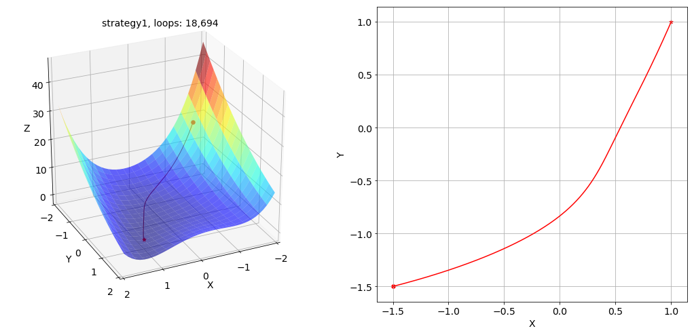
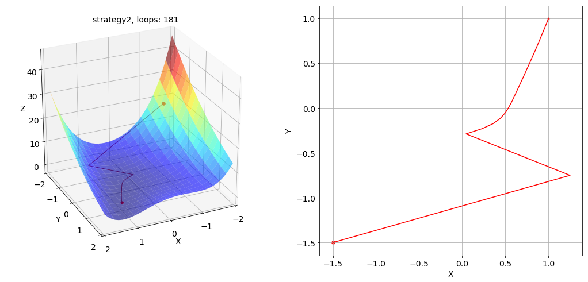

# Levenberg-Marquardt 算法

## 梯度下降算法

目前用于训练神经网络的算法通常是基于梯度下降法进行误差反向传播<a href='#fn1' name='fn1b'>[1]</a>，核心思想是以目标函数的负梯度方向为搜索方向，通过每次迭代使待优化的目标函数逐步减小，最终使误差函数达到极小值。附加动量因子记忆上次迭代的变化方向<a href='#fn2' name='fn2b'>[2]</a>，可以采用较大的学习速率系数以提高学习速度，但是参数调整优化过程依然线性收敛，相对速度依然较慢。  

### Rosenbrock 函数

我们选取 [Rosenbrock 函数](https://zh.wikipedia.org/wiki/Rosenbrock%E5%87%BD%E6%95%B8) 作为测试优化算法性能的函数，这是一个非凸函数，由公式 (1) 决定：  
$$
\begin{align}
f(x,y)=(a-x)^{2}+b(y-x^{2})^{2} \tag{1}
\end{align}
$$
令 $a=0.5, b=1$，可以得到：

  

### 学习率策略

为了测试不同 `learning rate` 下梯度下降算法的表现，我们采用了 `4` 种优化策略：
> 1. 固定学习率  $lr_{min}=0.001$；  
> 2. 固定学习率  $lr_{max}=0.1$；  
> 3. 固定学习率 $lr_{max}=0.1$，动量因子 $\beta=0.1$；   
> 4. 初始最大学习率  $lr_{max}=0.1$，每次迭代衰减为前次学习率的 $0.9$ 倍，最终学习率不小于 $lr_{min}=0.001$。  

策略 1 下寻找最优解的路径及其俯视图如下所示：

  

策略 2 下寻找最优解的路径及其俯视图如下所示：

  

策略 3 下寻找最优解的路径及其俯视图如下所示：

  

策略 4 下寻找最优解的路径及其俯视图如下所示：

  

根据结果，明显可以看出学习率 `learning rate` 选择过小或过大会导致网络训练过慢或震荡发散，整个网络的训练速度对学习率的选取依赖程度很高。完整的代码及 `notebook` 文件已上传至该 `repo` 的 `codes` 和 `notebooks` 文件夹：  
- [gradient_descent.py](./codes/gradient_descent.py)  
- [gradient_descent.ipynb](./notebooks/gradient_descent.ipynb)  

## Levenberg-Marquardt算法

LM算法<a href='#fn3' name='fn3b'>[3]</a>是一种利用标准数值优化技术的快速算法，具有高斯牛顿法的局部收敛性和梯度下降法的全局特性，在局部搜索能力上强于梯度下降法。LM算法基本思想是先沿着负梯度方向进行搜索，然后根据牛顿法在最优值附近产生一个新的理想的搜索方向。LM算法具有二阶收敛速度，迭代次数很少，可以大幅度提高收敛速度和算法的稳定性，避免陷入局部最小点的优点。  
第 `k+1` 次迭代时模型的参数由 $\mathbf{w}^{k+1}$ 决定<a href='#fn4' name='fn4b'>[4]</a>：
$$
\begin{align}
\mathbf{w}^{k+1}=\mathbf{w}^{k}+\Delta\mathbf{w}^{k} \tag{2}
\end{align}
$$
LM算法对模型参数的修正量 $\Delta \mathbf{w}$ 由公式 (3) 可以解出：
$$
\begin{align}
[\mathbf{J}^{T}(\mathbf{w})\mathbf{J}(\mathbf{w})-\mu \mathbf{I}]\Delta \mathbf{w}=-\mathbf{J^{T}}(\mathbf{w})\mathbf{e}(\mathbf{w}) \tag{3}
\end{align}
$$
其中，$\mathbf{J}(\mathbf{w})$ 为 [Jacobian矩阵](<https://en.wikipedia.org/wiki/Jacobian_matrix_and_determinant>)，$\mathbf{e}(\mathbf{w})$ 为均方误差。  

-----
**脚注 (Footnote)**

<a name='fn1'>[1]</a>：[Rumelhart D E, Hinton G E, Williams R J. Learning representations by back-propagating errors[J]. Cognitive modeling, 1988, 5(3): 1.](https://www.nature.com/articles/323533a0)  
<a name='fn2'>[2]</a>：[Vogl T P, Mangis J K, Rigler A K, et al. Accelerating the convergence of the back-propagation method[J]. Biological cybernetics, 1988, 59(4-5): 257-263.](https://link.springer.com/article/10.1007/BF00332914)  
<a name='fn3'>[3]</a>：[Levenberg K. A method for the solution of certain non-linear problems in least squares[J]. Quarterly of applied mathematics, 1944, 2(2): 164-168.](https://www.ams.org/journals/qam/1944-02-02/S0033-569X-1944-10666-0/S0033-569X-1944-10666-0.pdf)  
<a name='fn4'>[4]</a>：[Ван Л. Петросян О.Г. Распознавание лиц на основе классификации вейвлет признаков путём вейвлет-нейронных сетей // Информатизация образования и науки. 2018. №4. С. 129-139.](https://elibrary.ru/item.asp?id=36295551)  

<a href='#fn1b'><small>↑Back to Content↑</small></a>

